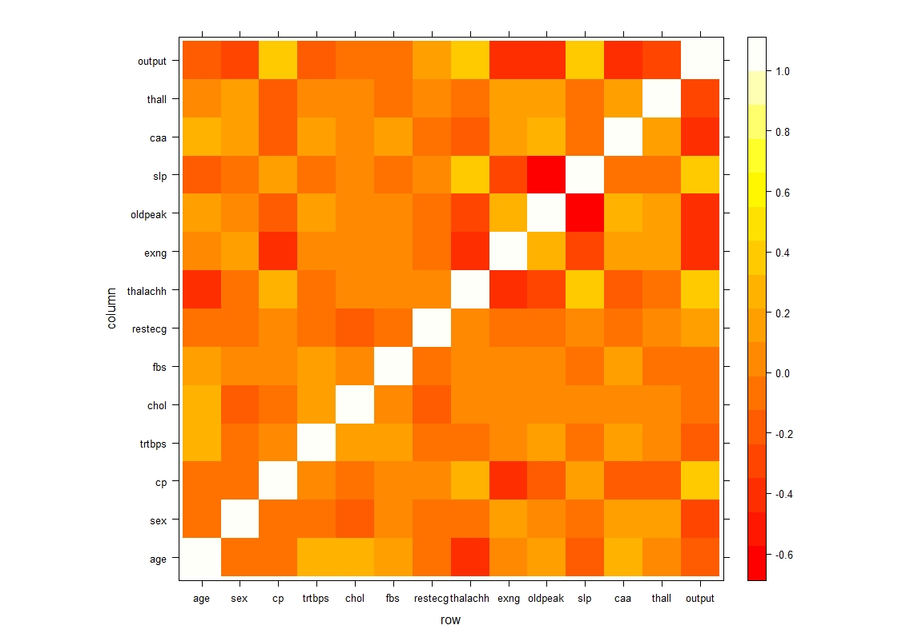
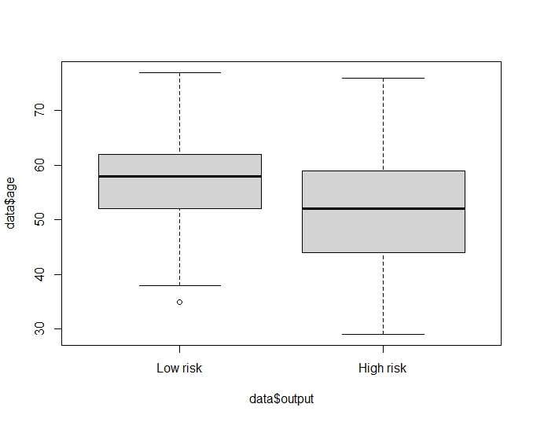

## Describe the data set.

In this dataset, there are 14 attributes and 303 patients information. Here is the link of this dataset: https://www.kaggle.com/rashikrahmanpritom/heart-attack-analysis-prediction-dataset?select=heart.csv 

The variable description is produced here from heart.csv file:

1. Age: Age of the person

2. Sex: Sex of the person (1 = male; 0 = female)

3. CP: Chest Pain type

   a. Value 0: asymptomatic

   b. Value 1: Atypical angina

   c. Value 2: non-angina pain

   d. Value 3: typical angina

4. Trtbps: resting blooding pressure (in mm Hg)

5. Chol: cholesterol in mg/dl fetched via BMI sensor.

6. Fbs: Fasting blood sugar > 120mg/dl (1 = true; 0 = false)

7. Restecg: resting electrocardiographic result.

   a. Value 0: normal

   b. Value 1: having ST-T wave abnormality – Level 1. 

   c. Value 2: Showing probable or definite left ventricular hypertrophy by Estes criteria – Level 2.

8. Thalachh: maximum heart rate achieved in beats per minute (bpm)

9. Exng: exercise induce angina (1 = Yes; 0 = No)

10. Oldepeak: previous peak

11. Slope: the slope of the peak exercise ST segment

    a. Value 0: down-sloping

    b. Value 1: flat

    c. Value 2: upsloping

12. Ca: number of major vessel (0-3) colored by fluoroscopy. (Categorical with 4 levels-0,1,2,3)

13. Thal: value 1: fixed defect; value 2: normal blood flow; value 3: reversible defect

14. Output: 0 = less chance of heart attack; 1 = more chance of heart attack. 

## Research Question 

The goal is to predict whether a person has high chance of heart disease based on pattern extracted from analyzing 13 descriptive features in the dataset. Does the angina that exercise included indicate high chance of heart attack? Does any other parameter also have an effect with the risk of heart attack? Does using a combination of features help us to better predict the result?

## Summarize the data relating to all feature by output

In this dataset, there are 13 different attributes that are numerical and categorical. The numerical variables are age, trtbps, chol, thalach and oldpeak. The categorical attributes are sex, cp, restecy, exng, slope and thall. To illustrate the relationship between the attributes, there is a heatmap. 

It is clear to find the relationship between age, chol, trtbps and thalach between the numerical attributes. 

Here is positive linear relationship between age and blood pressure. When age increase, the blooding pressure increase at the same time. 

There is positive linear relationship between age and cholesterol. 

There is a negative linear relationship between age and thalach. 

## Numerical features:

There is not significant difference between different age phase in this boxplot so that age might not be a predictive feature. 

There is not significant difference between different blood pressures phase in this boxplot so that trtbps might not be a predictive feature.

There is not significant difference between different cholesterol phase in this boxplot so that chol might not be a predictive feature.

There is a significant difference between high maximum heart rate in this boxplot so that thalachh might be a predictive feature.

There is a significant difference in this boxplot so that oldpeak might be a predictive feature.

## Category Feature

As can be seen in this bar plot, male has higher risk in heart disease. Gender might be a predictive feature. 

As can be seen in this bar plot, the people who has asymptomatic chest pain has high risk to have heart disease, so that cp might be predictive feature. 

As can be seen in this bar plot, there is not significant relationship between fasting bold sugar and heart disease. True or false on fasting blood sugar might not be a predictive feature.

As can be seen in this bar plot, the patient who feel normal in resting ECG has half and half possible to has heart disease, and ST-T wave abnormality has lower possible to have heart disease, so that restecg might not be a predictive feature. 

As can be seen in this bar plot, the patient who has exercised induced angina has higher risk in heart disease, so that exng might be a predictive feature.

As can be seen in the bar plot of the slope of the peak exercise ST segment, majority heart disease patient exhibiting a flat ST slope so that slope might be a predictive feature. 

As can be seen in this bar plot, as the number of major vessels increase, the risk of heart disease increase. Caa might be a predictive feature.

As can be seen in this bar plot, the patients who has reversible defect in thalassemia have higher risk in heart disease. 

At the end, oldpeak, thalach, sex, cp, exng, slope and thall might be predictive features, but we will have more verifications in the following steps. 

Our explanatory variables are age, trtbps, chol, thalach, oldpeak, sex, cp, fbs, restecg, exng, slope, caa and thall. The output is whether the patient had high risk in heart attack. To find out the relationship between explanatory variables and output, we use global null hypothesis at the alpha level with multiple logistic regression.

Here is a summary of explanatory variables from the data. 

The test for the global null hypothesis tests:

The p-value for the global test was 2.3e-06. Since we reject the null hypothesis and conclude that there is at least one beta is no equal to 0.

Regression Coefficient for age:

We fail to reject the null hypothesis that or after adjusting other variables since p-value is larger than alphas . We do not have significant evident at the alpha = 0.05 level that beta-age (p=0.706)

Regression Coefficient for sex:

We reject the null hypothesis that or after adjusting other variables since p-vale is smaller or equal to alpha. We have significant evident at the level that beta-sex is not equal to 0 (p=0.003653)

Regression Coefficient for chest pain:

We reject the null hypothesis that or after adjusting other variables since p-vale is smaller or equal to alpha. We have significant evident at the level that beta-cp is not equal to 0 (p=0.00294)

Regression Coefficient for trtbps:

We fail to reject the null hypothesis that or after adjusting other variables since p-value is larger than alphas . We do not have significant evident at the alpha = 0.05 level that beta-trtbps (p=0.06)

Regression Coefficient for chol:

We fail to reject the null hypothesis that or after adjusting other variables since p-value is larger than alphas . We do not have significant evident at the alpha = 0.05 level that beta-chol (p=0.25)

Regression Coefficient for fbs:

We fail to reject the null hypothesis that or after adjusting other variables since p-value is larger than alphas . We do not have significant evident at the alpha = 0.05 level that beta-fbs (p=0.57)

Regression Coefficient for restecg:

We fail to reject the null hypothesis that or after adjusting other variables since p-value is larger than alphas . We do not have significant evident at the alpha = 0.05 level that beta-restecg (p=0.24)

Regression Coefficient for thalachh:

We fail to reject the null hypothesis that or after adjusting other variables since p-value is larger than alphas . We do not have significant evident at the alpha = 0.05 level that beta-thalachh(p=0.31)

Regression Coefficient for exng:

We reject the null hypothesis that or after adjusting other variables since p-vale is smaller or equal to alpha. We have significant evident at the level that beta-exngis not equal to 0 (p=0.046)

Regression Coefficient for oldpeak:

We fail to reject the null hypothesis that or after adjusting other variables since p-value is larger than alphas . We do not have significant evident at the alpha = 0.05 level that beta-oldpeak (p=0.14)

Regression Coefficient for slp:

We fail to reject the null hypothesis that or after adjusting other variables since p-value is larger than alphas . We do not have significant evident at the alpha = 0.05 level that beta-slp (p=0.12)

Regression Coefficient for caa:

We reject the null hypothesis that or after adjusting other variables since p-vale is smaller or equal to alpha. We have significant evident at the level that beta-caa not equal to 0 (p=0.0007)

Regression Coefficient for thall:

We reject the null hypothesis that or after adjusting other variables since p-vale is smaller or equal to alpha. We have significant evident at the level that beta-thall not equal to 0 (p=0.042)

In conclusion, sex, cp, exng, caa, and thall have significant evidence to show their regression coefficients are not zero. And we use them to train the multiple logistic regression model. 

To avoid underfit and overfit, I split data into training dataset and testing dataset with the ratio 80:20. 

Train the multiple logistical regression with all explanatory variables, the error rate is 9.83%.

Train the multiple logistical regression with the variables that has significant evidence to show their coefficients are not zero. The error rate decreases. 

TP = 26, FP=1, FN=4, TN=30, the accuracy is 91.8% and error rate is 8.19%. 

## Summary:

Exploration of the data indicated that gender, the type of chest pain, exercise induced angina, beta-thalassemia and number of major vessels are possible useful features for predicting the presence of heart attack. 
